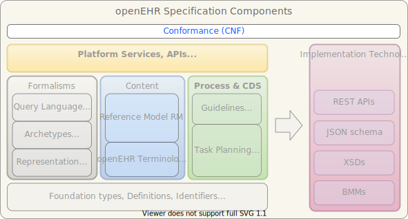

//
// ============================================ Asciidoc HEADER =============================================
//
include::{ref_dir}/docs/boilerplate/basic_style_settings.adoc[]

:keywords: conformance
:description: openEHR Conformance Specifications

include::{ref_dir}/docs/boilerplate/global_vars.adoc[]

//
// ============================================ Asciidoc PREAMBLE =============================================
//

image::{openehr_logo}["openEHR logo",align="center"]

:numbered!:
= Conformance Specifications (CNF) - {cnf_release}

// Use the following version for 'latest'
ifeval::["{cnf_release}" == "latest"]
[.title-para]
{component_prs}[Open Issues^] | {component_roadmap}[Roadmap^] | {component_history}[Previous Releases^] 
endif::[]

// Use the following version for a release
ifeval::["{cnf_release}" != "latest"]
:cnf_prs_fixed: {component_prs_fixed}{cnf_release}/issues
:cnf_crs_done: {component_crs_done}{cnf_release}/changes
[.title-para]
{cnf_prs_fixed}[Issues Fixed^] | {cnf_crs_done}[Changes Implemented^] | {component_roadmap}[Roadmap^] | {component_history}[Change History^]
endif::[]

== Specifications

[cols="2,5,2", options="header"]
|===
|Specification |Description |Wiki

|link:/releases/CNF/{cnf_release}/openehr_platform_conformance.html[openEHR EHR Platform Conformance]
|Specification of formal conformance to the openEHR EHR Platform definition.
a|* {openehr_wiki_root}/spaces/spec/pages/94181296/Conformance+Notes+-+SEC+meeting+Alkmaar+2017[Alkmaar 2017 notes];
* {openehr_wiki_root}/spaces/spec/pages/73367558/openEHR+Conformance[Original page].

|===

== Computable Expressions
 
[cols="2,5", options="header"]
|===
|Resource |Description

|REST APIs
|See link:/releases/ITS/latest/docs/index[(REST APIs)]

|Service Model (SM)
|See link:/releases/SM/latest/docs/index[SM Index page].

|===

