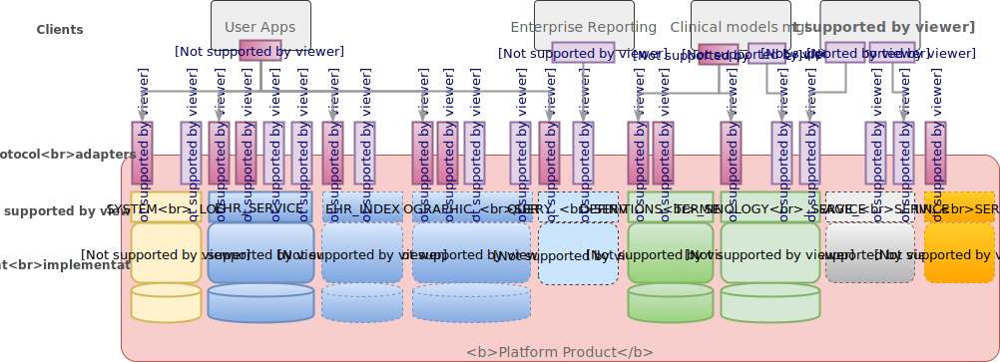

= Evaluation Environment

Conformance evaluation relies on a normative idea of systems that may be tested against a set of specifications on which they claim to be based. This section describes the assumptions that are made about systems that may be tested according to this conformance specification.

== System Under Test (SUT)

It is assumed that any system provided to be tested for conformance under this specification has a _platform_ architecture, i.e. consisting of one or more _product components_ that are exposed via corresponding _services_, and that the component semantics are based on published openEHR specifications. Consequently, certain types of components are assumed and named in this specification, e.g. 'EHR Persistence', 'Demographic Persistence', 'Querying' and so on. These need not correspond to the product's own names for these components.

The service interface of any component can be understood at two levels: an abstract formal interface, and one or more implementation technology interfaces. The former is defined in terms of a formal service model, which is considered normative in openEHR, and is understood as expressing the _formal, transactional semantics_ of each component.

At an implementation technology level, the service model may be directly exposed as a software component interface e.g. a Java .jar, .Net assembly, Linux .so library etc. Such programming models will usually implement the transactional interfaces in a direct sense, and can thus be considered concrete implementations of the service model.

The transactional service model will also usually be available via one or more web protocol interfaces in the form of WSDL/SOAP and/or REST APIs. Any such interface is assumed to connect to the underlying transactional interface. A REST API is assumed to exist for the purposes of conformance testing. Accordingly, the formal expression of test cases that exercise underlying service calls is in the form of scripts based on the REST API.

Each of the concretely available implementation technology interfaces is also regarded as a product component, for which conformance testing may be conducted.

NOTE: this may be augmented in the future by an equivalent set of test cases for WSDL/SOAP and other API technologies.

In addition, in order to enable testing to take place, various tools are recommended, including a system log viewer, a data viewer and a test application.

The following figure illustrates the test environment, based on currently available specifications. As further specifications are published, the extent of coverage of testing will grow.

[.text-center]
.Conformance System Under Test

In the above, elements with solid outlines are required, while elements with dashed outlines are those that may or may not be part of a given product. The generic portal is not considered part of the system under test, but an additional tool available to facilitate testing. Any actual system under test will normally consist of the mandatory parts plus one or more other components germane to the intended product function.

The following sections describe the elements of this environment in more detail.

=== Normative Platform Service Model

The formal transactional interface to a product's openEHR components is specified by the {openehr_sm_openehr_platform}[openEHR Platform Service Model], which defines a set of services and for each component, as shown below.

[.text-center]
.Normative openEHR Platform
image::{openehr_sm_uml_diagrams}/SM-platform_model.svg[id=normative_openehr_platform, align="center"]

The functions defined on these interfaces constitute the _formal conformance points_ of this specification. For example, the conformance point for the logical 'create EHR' operation is defined by the functions `_create_ehr()_`, `_create_ehr_with_id()_`, `_create_ehr_for_subject()_`, `_create_ehr_for_subject_with_id()_` defined on the service interface `I_EHR_SERVICE` shown in the above diagram. Information conformance (i.e. conformance to the types stated in service call arguments and return values) is primarily defined by the openEHR specifications for the relevant components, i.e. RM (Reference Model) etc, however, a small number of service model-specific information structures are defined by the service specification.

Any given SUT is not assumed to implement all of these interfaces, or the underlying components. However, the components for which conformance is to be tested are assumed to be testable via the relevant interfaces above.

Real products may of course provide alternative forms of some services, e.g. System Log, Administrative interface and so on.

=== REST APIs

As a practical measure for the purposes of undertaking testing, this specification assumes that service interfaces to be tested are concretely accessible by the {openehr_rest_apis}[openEHR REST APIs]. For this reason, the openEHR REST APIs are assumed to be implemented by the system to an _extent sufficient for performing the tests_, i.e. not all calls in the full REST APIs are required for the conformance testing described here. Which calls are required is indicated in the Conformance Schedule below. In some cases, more than one alternative REST API call can be used to exercise the same underlying service call.

The openEHR REST APIs handle data in two ways: canonical openEHR XML, based on the {openehr_its_rm_xsds}[published XML schemas (XSDs)], and a JSON equivalent, which is defined as a standard transform of openEHR object structures. The providers of the SUT may opt for either format, and are only _required_ to implement one.

[.tbd]
ISSUE: where is the JSON defined, details?

=== Testing Tools

In order to conduct tests in reasonable way, some further informal assumptions are made about the SUT, as follows:

* it has a _system logger_, which may be external or part of the product, and if it exists, is accessible in the test environment via an appropriate interface or viewer tool;
* it may have a _generic data viewer_ available, i.e. a web application that be used in a normal brower that enables the data and other state in the principal services to be viewed in a generic way.

Neither of these tools are assumed to conform to any particular specification.

== Manual Testing

TBD

== Automated Testing

Automated conformance testing is performed by the interaction of the openEHR CNF-test web service with a system under test. A test configuration indicates which conformance claims are to be tested (e.g. `functional=CORE; content=STANDARD+OPTIONS`), and appropriate sets of tests are executed. The result is a detailed test report, together with the highest conformance levels reached in the requested categories.
