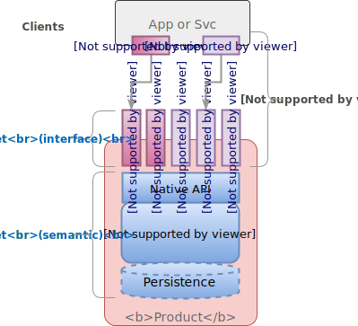
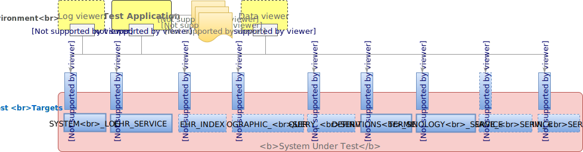

= Evaluation Environment

Conformance evaluation relies on a normative idea of systems that may be tested against a set of specifications on which they claim to be based. This section describes the assumptions that are made about systems that may be tested according to this conformance specification.

== System Under Test (SUT)

=== General description

The totality of what is provided for conformance testing according to this specification is known as the _system under test_, or SUT. It is assumed that any such system has a _platform_ architecture, consisting of one or more _product components_ that are exposed via corresponding _native service APIs_, and that the component semantics and API are based on published openEHR specifications. At an implementation level, a native API is exposed via a software component interface e.g. a Java .jar, .Net assembly, Linux .so library etc.

It is also assumed that native APIs are network-accessible via one or more communications protocols, each with an appropriate _protocol adapter_. Such protocols include the text-based, such as {soap_protocol}[SOAP/WSDL] and {rest_ws}[REST], as well as the many binary protocols, including {google_protobuf}[Google Protocol Buffers], {apache_thrift}[Apache Thrift], {apache_avro}[Avro], {apache_kafka}[Kafka], {zeroc_ice}[ZeroC ICE], and {ampq}[Advanced Message Queueing Protocol (AMPQ)]. The general model is shown below.

[.text-center]
.Component Model

In the above, there are two _test targets_ for any given component in the SUT, i.e. two aspects of a component for which conformance is to be determined:

* Semantic: the _formal, transactional semantics_ of the component's exposed functions and procedures when called;
* Interface(s): the concrete interfaces provided by the component.

The former needs to be tested to determine if the component does what it is functionally intended to do, and is documented in terms of abstract interface definitions that include pre-conditions, post-conditions and exceptions. The latter is tested to determine that the concrete means of accessing the component provided by its developer do indeed provide that access correctly, and conform to accepted norms of the relevant kind of service interface (i.e. REST, AMPQ etc).

To establish a common basis for naming and describing components of an openEHR Platform, the {openehr_sm_openehr_platform}[openEHR Platform Abstract Service Model] may be used. This defines a standard set of openEHR component names along with definitions of the transactional semantics of each component, i.e. the 'semantic' test target referred to above. A product's own component names need not correspond to the openEHR component names of course, but for the purupose of testing the logical mapping of the two should be provided by a developer.

Each of the concrete protocol interfaces is defined by its own specification, for example the {openehr_rest_apis}[openEHR REST API specification], and may be regarded as a product component, for which conformance testing may be conducted. No assumption is made that any given product supports any particular protocol(s), although a minimal set of REST APIs on components such as the System Log is likely to be useful for testing purposes.

The following figure illustrates a typical platform product, consisting of components and protocol interfaces as described above. Part or all of the platform (back-end) of such a product is provided for testing according to this specification.

[.text-center]
.Conformance System Under Test
image::diagrams/conformance_sut.svg[id=conformance_sut, align="center"]

As a consequence of the above, the conformance test schedule defined by this specification consists of tests for both native component semantics, and for whichever concrete protocol interfaces are provided. From a practical point of view, the testing is always conducted via the concrete interfaces i.e. REST, SOAP, protobuf etc) as appropriate to the particular product. For a product that implements the openEHR REST APIs, the SUT environment is of the following form:

[.text-center]
.System Under Test - REST

In the test environment, a _test application_ with the appropriate protocol client(s) is used to exercise the SUT. A system log viewer and a data viewer may be provided as part of the product in order to facilitate human interaction with the system, but these are not obligatory.

In the same fashion, the SUT for a product that exposes APIs using Google Protocol Buffers will look as follows.

[.text-center]
.System Under Test - Protocol Buffers
image::diagrams/conformance_sut_protobuf.svg[id=conformance_sut_sut_protobuf, align="center"]

Other combinations of components and protocols may of course occur in the SUT and testing applications.

=== Platform Abstract Service Model

The formal transactional interface to a product's openEHR components is specified by the {openehr_sm_openehr_platform}[openEHR Platform Abstract Service Model], which defines a set of services and for each component, as shown below.

[.text-center]
.Platform Abstract Service Model
image::{openehr_sm_uml_diagrams}/SM-platform_model.svg[id=platform_abstract_sm, align="center"]

The functions defined on these interfaces constitute the _functional conformance points_ of this specification. For example, the conformance point for the logical 'create EHR' operation is defined by the functions `_create_ehr()_`, `_create_ehr_with_id()_`, `_create_ehr_for_subject()_`, `_create_ehr_for_subject_with_id()_` defined on the service interface `I_EHR_SERVICE` shown in the above diagram. Information conformance (i.e. conformance to the types stated in service call arguments and return values) is primarily defined by the openEHR specifications for the relevant components, i.e. RM (Reference Model) etc, however, a small number of service model-specific information structures are defined by the service specification.

Any given SUT is not assumed to implement all of these interfaces, or the underlying components. However, the components for which conformance is to be tested are assumed to be testable via the relevant interfaces above.

Real products may of course provide alternative forms of some services, e.g. System Log, Administrative interface and so on.

== Manual Testing

TBD

== Automated Testing

Automated conformance testing is performed by the interaction of the openEHR CNF-test web service with a system under test. A test configuration indicates which conformance claims are to be tested (e.g. `functional=CORE; content=STANDARD+OPTIONS`), and appropriate sets of tests are executed. The result is a detailed test report, together with the highest conformance levels reached in the requested categories.
